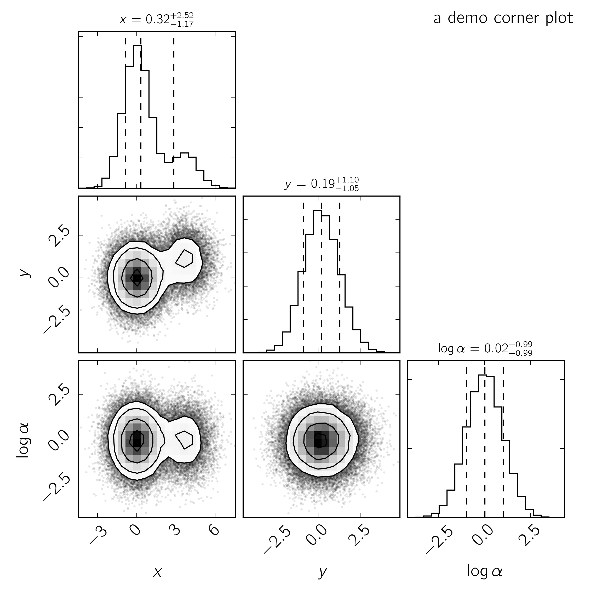

# Summary

This Python module uses matplotlib [@matplotlib] to visualize
multidimensional samples using a scatterplot matrix.
In these visualizations, each one- and two-dimensional projection of the
sample is plotted to reveal covariances.
*corner* was originally conceived to display the results of Markov Chain
Monte Carlo simulations and the defaults are chosen with this application in
mind but it can be used for displaying many qualitatively different samples.

Development of *corner* happens on GitHub and any issues can be raised there
[@corner_github].
*corner* has been used extensively in the astronomical literature and it has
occasionally been cited as `corner.py` or using its previous name
`triangle.py` [@adsabs].
The source code for *corner* has been archived to Zenodo and it has the DOI
[@corner_archive]

The following is a simple demonstration of a visualization made with *corner*:

-

# References
